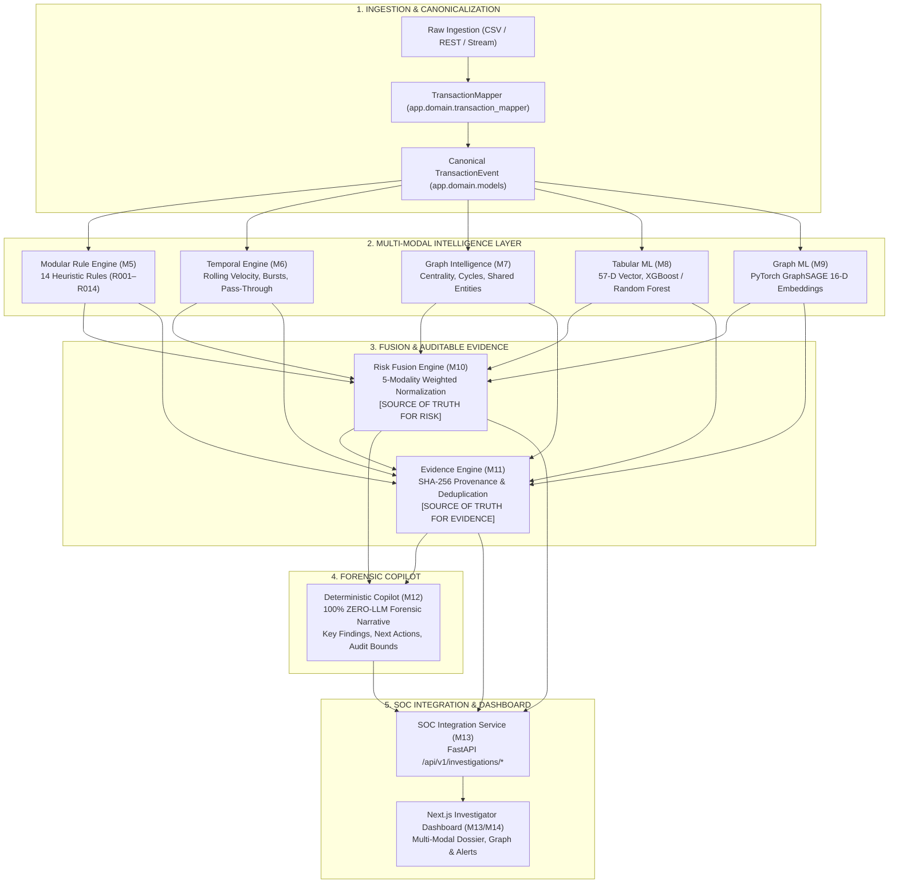

# MuleTrace AI — Complete Architecture, Engineering & Migration Source of Truth

> **Project**: MuleTrace AI  
> **Target Event**: AWS First Commit Hackathon  
> **Document Purpose**: Authoritative, Immutable Single Source of Truth for Human Engineers & AI Agents  
> **Current Status**: **BUILD IT COMPLETE (M0–M14) | SHIP IT PLANNED (NOT STARTED)**  
> **Release Version**: `1.0.0-alpha` (Localhost Operational Baseline)  
> **Audited Date**: September 20, 2026  
> **Primary Roles**: Principal Software Architect, AWS Solutions Architect, Senior ML/Graph Engineer, Senior DevSecOps Engineer, Technical Writer, Documentation Auditor  

---

## 1. Absolute Zero-Hallucination Protocol

The actual codebase and executed test suites are the highest source of truth in the MuleTrace AI project.

All engineers, reviewers, and AI coding agents MUST categorize every statement according to this schema:
- **`CURRENT / IMPLEMENTED`**: Fully written in source code, active in the repository, and verified locally.
- **`VERIFIED`**: Confirmed by automated test suites (`pytest`), static analysis (`tsc`), or live localhost smoke checks.
- **`PLANNED`**: Formally designed and scheduled for future milestones (specifically the SHIP IT phase), but **NOT YET IMPLEMENTED**.
- **`PROPOSED`**: Conceptual architecture under evaluation; no implementation committed.
- **`DEFERRED`**: Intentionally postponed to avoid premature optimization or scope creep during BUILD IT.
- **`UNKNOWN / NOT VERIFIED`**: Requires direct repository inspection before any factual claim can be made.

> [!CRITICAL]
> **Strict AWS Status Mandate**:  
> All AWS managed services (AWS CDK, AWS Lambda, Amazon API Gateway, Amazon RDS, Amazon Neptune, Neptune Analytics, Amazon S3, AWS Secrets Manager, Amazon CloudWatch, AWS Amplify, Amazon Bedrock) are **`PLANNED — NOT YET IMPLEMENTED`**.  
> The existing application runs **100% locally on localhost** without cloud dependencies. No AWS SDK (`boto3`, `aioboto3`), Dockerfile, or CloudFormation template is active in the repository.

---

## 2. Source-of-Truth Hierarchy

When evaluating system behavior or resolving conflicts, the following hierarchy strictly governs:

1. **Actual Current Source Code**: `backend/` and `frontend/` source files. (Source code wins over documentation).
2. **Actual Current Tests**: `backend/tests/` (471 passing tests define the verifiable contract).
3. **Current Configuration Files**: `requirements.txt`, `package.json`, `.env.example`.
4. **Current Repository Structure**: Physical files, directories, and committed artifacts.
5. **Latest Verified Milestone Report**: `docs/reports/M14_BUILD_IT_RELEASE_REPORT.md`.
6. **Historical Milestone Reports**: `docs/reports/M0` through `M13`. (Historical reports describe past states; current code overrides older reports).
7. **Planned Architecture Documents**: `docs/architecture/` (Forward-looking guidelines).
8. **General Assumptions / Extrapolations**: **STRICTLY FORBIDDEN.**

---

## 3. Repository Audit Summary

Prior to creating this document, an exhaustive audit of the repository was conducted:
- **Root Directory**: Contains clean monorepo structure: `backend/`, `frontend/`, `ml/`, `docs/`, `tests/`. No stray cloud templates or orphan binaries.
- **Backend**: FastAPI entry point in `app/main.py`, master v1 router in `app/api/v1/router.py`, domain models in `app/domain/`, repositories in `app/repositories/`, intelligence engines in `app/engines/`, SQLAlchemy models in `app/models/`.
- **Frontend**: Next.js 14 App Router in `frontend/src/app/` (`/dashboard`, `/investigations`, `/alerts`, `/graph`, `/geo`, `/reports`), custom API client in `frontend/src/lib/api.ts`, TypeScript definitions in `frontend/src/lib/types.ts`.
- **Dependencies**: Python dependencies pinned in `backend/requirements.txt` (FastAPI, SQLAlchemy, asyncpg, psycopg2, neo4j, xgboost, pandas, scikit-learn, pytest, black, ruff). Node dependencies in `frontend/package.json`.
- **Git Status**: Only tracked modifications from earlier milestone integration and untracked files from M1–M14 additions exist. No secrets, credentials, or `.env` files are tracked.

---

## 4. AWS Implementation Audit

A comprehensive search of the repository for AWS services and SDKs confirmed the following factual status:

| AWS Component / Service | In Repository? | Current Implementation Status | Notes |
| :--- | :---: | :---: | :--- |
| **`boto3` / `aioboto3`** | **NO** | **NOT IMPLEMENTED** | Zero AWS SDKs in `requirements.txt` or source code. |
| **AWS CDK (`cdk.json`, `lib/`, `bin/`)** | **NO** | **NOT IMPLEMENTED** | No Infrastructure as Code exists. |
| **AWS Amplify (`amplify.yml`)** | **NO** | **NOT IMPLEMENTED** | Frontend runs via local Next.js dev server. |
| **AWS Lambda / Mangum** | **NO** | **NOT IMPLEMENTED** | Backend runs via Uvicorn on localhost:8000. |
| **Amazon API Gateway** | **NO** | **NOT IMPLEMENTED** | API requests routed directly to Uvicorn. |
| **Amazon RDS / Aurora PostgreSQL** | **NO** | **NOT IMPLEMENTED** | Relational DB uses local PostgreSQL instance. |
| **Amazon Neptune / Neptune Analytics** | **NO** | **NOT IMPLEMENTED** | Graph storage uses NetworkX (in-memory) & Neo4j. |
| **Amazon S3** | **NO** | **NOT IMPLEMENTED** | ML models and reports stored in local filesystem. |
| **Amazon Bedrock** | **NO** | **NOT IMPLEMENTED** | Copilot (M12) is 100% deterministic, zero-LLM. |
| **AWS Secrets Manager** | **NO** | **NOT IMPLEMENTED** | Local settings loaded via `python-dotenv`. |
| **Amazon CloudWatch / X-Ray / Powertools** | **NO** | **NOT IMPLEMENTED** | Logging uses Python's standard `logging` library. |
| **Docker / Dockerfile / docker-compose** | **NO** | **NOT IMPLEMENTED** | Local execution is native on the Windows host. |
| **Terraform / SAM / CloudFormation** | **NO** | **NOT IMPLEMENTED** | Zero IaC templates committed. |

---

## 5. Git Safety & Integrity Baseline

- **Repository Workspace**: `D:\Team_Cipher_Unit`
- **Git Tracking Policy**:
  - `backend/.env` and `frontend/.env.local` are explicitly ignored via `.gitignore` and verified untracked.
  - Zero application code, database migrations, configurations, or tests are modified during the creation of this report.
  - Only `REPORT.md` is added to the repository root.

---

## 6. Project Identity

**MuleTrace AI** is an advanced, multi-modal financial crime intelligence and mule account detection platform engineered for banking, Anti-Money Laundering (AML) compliance, and cybercrime investigation units.

### Core Objectives:
- Identify and dismantle money mule rings, structuring funnels, and layered fund-routing syndicates across multiple retail payment rails (UPI, IMPS, NEFT, RTGS, Card, ATM, and Crypto Off-Ramps).
- Deliver explainable, cryptographically verifiable forensic evidence packages for compliance officers and law enforcement.
- Provide a deterministic investigation copilot that synthesizes factual case narratives without the hallucination risks of generative LLMs.

### Target Personas:
- **AML Operations Investigators (Tier 1 & Tier 2)**: Rapid triage of high-risk transaction alerts.
- **Forensic Financial Analysts & MLROs**: In-depth network analysis, circular fund-flow tracing, and preparation of Suspicious Transaction Reports (STRs).
- **Compliance & Regulatory Auditors**: Verification of algorithmic decision trails.

### Architectural Philosophy:
MuleTrace AI distinguishes sharply between:
- **BUILD IT (Milestones M0–M14)**: Building and hardening the complete intelligence and investigation platform on local infrastructure, proving algorithmic efficacy, multi-modal risk fusion, and investigator workflows.
- **SHIP IT (Future Milestones)**: Migrating the hardened application to AWS managed cloud services using clean adapter boundaries without rewriting business logic.

> [!NOTE]
> MuleTrace AI is an algorithmic decision-support and forensic investigation platform. It provides high-confidence risk scoring and evidence aggregation; it does not claim statutory regulatory certification or 100% error-free fraud elimination.

---

## 7. Problem Statement & Multi-Modality Need

Financial fraud and cybercrime syndicates increasingly operate decentralized "mule networks"—swarms of compromised, rented, or newly opened bank accounts used to layer and cash out stolen funds.

### The Forensic Detection Challenges:
1. **Structuring / Smurfing**: Evading threshold-based reporting by splitting transactions into values just below detection limits (e.g., ₹48,000–₹49,999).
2. **Mule Chains (Rapid Pass-Through)**: Inward funds are rapidly transferred out within 5 to 15 minutes, leaving minimal balance for bank recovery.
3. **Topological Rings & Wash Laundering**: Routing funds through cycles of 3 to 7 accounts, eventually returning funds to the originator or an allied collector.
4. **Hardware & IP Syndicates**: Criminal controllers logging into dozens of mule accounts from a single device hardware identifier (IMEI/UUID) or shared residential/VPN IP subnets.
5. **Dormant Reactivation & Burner Accounts**: Long-dormant accounts (>90 days) suddenly reactivated for explosive burst operations, or newly opened accounts (<7 days) exhibiting intense velocity.

### Why Multi-Modality is Required:
A single analytical technique cannot reliably detect modern mule operations:
- **Heuristic Rules** catch known statutory patterns, but fail on novel evasion strategies.
- **Temporal Engines** capture velocity acceleration and inter-transaction intervals, but lack topological context.
- **Graph Engines** uncover structural rings and hub centrality, but miss tabular statistical anomalies.
- **Tabular ML** identifies multi-dimensional statistical outliers, but cannot see relational network topology.
- **Graph Neural Networks (GraphSAGE)** learn inductive structural embeddings across neighborhoods, but require heuristic constraints for regulatory explainability.

Only by fusing all five modalities into an integrated risk score and evidence engine can an institution detect complex mule activity with high precision and low false positives.

---

## 8. Core Architectural Principle

```
======================================================================
  BUSINESS LOGIC = CLOUD AGNOSTIC
  INFRASTRUCTURE = REPLACEABLE THROUGH ADAPTERS
======================================================================
```

MuleTrace AI is architected around **Ports-and-Adapters (Hexagonal Architecture)**:
1. **Pure Business Logic Core**: All 14 fraud rules, temporal window calculations, graph centrality metrics, tabular ML feature builders, GraphSAGE neural network architectures, risk fusion mathematics, evidence collectors, and copilot templates are written in pure Python. They do NOT depend on cloud SDKs, specific web frameworks, or vendor database drivers.
2. **Ports as Abstract Base Classes**: External boundaries (graph stores, database repositories, ML inference engines, copilot services) are declared as abstract interfaces in `backend/app/domain/interfaces.py`.
3. **Pluggable Infrastructure Adapters**: In the current **BUILD IT** phase, local adapters (NetworkX, local SQLite/PostgreSQL, local joblib pipelines, deterministic templates) fulfill the domain contracts. In the future **SHIP IT** phase, AWS managed service adapters (Amazon Neptune, Amazon RDS, Amazon S3, Amazon Bedrock) will implement the exact same interfaces without altering the core intelligence layer.

---

## 9. Legacy Architecture & Motivation for Redesign

### The Legacy Baseline (Pre-M1 State):
Prior to the milestone-driven architecture program, the application was a rapid prototype:
```
Transaction Ingestion ──▶ FastAPI ──▶ PostgreSQL + Neo4j ──▶ Monolithic RuleEngine ──▶ Next.js UI
```

### Architectural Limitations of the Legacy System:
1. **Monolithic Rule Coupling**: Detection rules were implemented as private methods inside a monolithic `RuleEngine`. Testing a single rule required executing the entire suite.
2. **Implicit Data Schemas**: Transactions were handled as loosely typed dictionaries with inconsistent key naming (`sender_id` vs `from_account` vs `account_number`), causing runtime errors during batch processing.
3. **Hardcoded Database Coupling**: Analytics routines executed direct Cypher and SQL queries inside service methods, making it impossible to run automated tests without active Neo4j and PostgreSQL instances.
4. **Opaque Risk Scoring**: Individual rule contributions were arbitrarily summed and clamped at 100, resulting in score inflation and preventing investigators from identifying the primary risk driver.
5. **Hallucination Risk**: Narrative generation concepts relied on unconstrained text prompts without verified evidence linkages.

---

## 10. Redesigned Architecture Evolution

The milestone program systematically modernized the architecture across 14 discrete, verified phases:

```
[Legacy Monolith]
       ↓
[M1] Canonical Domain Model (TransactionEvent & TransactionMapper)
       ↓
[M2] Hexagonal Domain Ports (GraphRepository, ModelService, Copilot)
       ↓
[M3/M4] Decoupled Graph Adapters (In-memory NetworkX & Neo4j parity)
       ↓
[M5] Modular 14-Rule Engine (R001–R014 isolated plugins)
       ↓
[M6] Specialized Temporal Engine (Sliding-window velocity & turnaround)
       ↓
[M7] Graph Intelligence Engine (Topological metrics & cycle mining)
       ↓
[M8] Tabular ML Subsystem (57-D vector, XGBoost/RF, zero heuristic leakage)
       ↓
[M9] Graph ML Subsystem (PyTorch GraphSAGE, 16-D node embeddings)
       ↓
[M10] Multi-Modal Risk Fusion Engine (Sole Source of Truth for Risk)
       ↓
[M11] Deterministic Evidence Engine (SHA-256 Provenance, Sole Source of Truth for Evidence)
       ↓
[M12] Deterministic Investigation Copilot (100% Zero-LLM Narrative Synthesis)
       ↓
[M13] SOC Integration Service & Next.js Dossier Integration
       ↓
[M14] BUILD IT Release Hardening (Localhost Frozen, 471 Passed Tests)
```

---

## 11. Current BUILD IT Architecture



---

## 12. Complete End-to-End Data Flow

Every transaction evaluated by MuleTrace AI follows this deterministic lifecycle:

| Stage | Input | Output | Responsibility | Source of Truth | Determinism | Persistence | Infra Dependency |
| :--- | :--- | :--- | :--- | :--- | :--- | :--- | :--- |
| **1. Mapping** | Raw dict / CSV row | `TransactionEvent` | Schema validation, timestamp UTC normalization, currency parsing, metadata preservation | `app.domain.models` | 100% Deterministic | None | In-memory |
| **2. Modular Rules** | `TransactionEvent` + Account context | `EvaluationResult` | Execute 14 modular heuristics (R001–R014) independently | `app.engines.rules` | 100% Deterministic | None | In-memory |
| **3. Temporal Intel** | `TransactionEvent` + Historical window | `TemporalFeatures` | Compute 1h/24h/7d velocity, turnaround ratios, dormancy acceleration | `app.engines.temporal` | 100% Deterministic | None | In-memory |
| **4. Graph Intel** | `TransactionEvent` + Subgraph | `GraphFeatures` | Compute in/out degree, hub centrality, cycle detection, shared device/IP links | `app.engines.graph` | 100% Deterministic | Graph Repo | NetworkX / Neo4j |
| **5. Tabular ML** | 57-D numerical vector | `ModelPrediction` | Infer statistical fraud probability via XGBoost/Random Forest | `app.engines.ml.tabular` | Deterministic (Fixed Seed) | Local `.pkl` | In-memory |
| **6. Graph ML** | 16-D node tensors + ego-graph | `ModelPrediction` | Infer mule probability via PyTorch GraphSAGE continuous embeddings | `app.engines.ml.graph` | Deterministic (Fixed Seed) | Local `.pt` | In-memory / CPU |
| **7. Risk Fusion** | 5 Modality Scores | `FusionResult` | Normalize inputs to [0,1], apply weights, handle missing signals, compute composite score [0,100] & tier | `app.engines.risk_fusion` (M10) | 100% Deterministic | None | In-memory |
| **8. Evidence Engine**| All Engine Outputs + `FusionResult` | `EvidencePackage` | Extract structured findings, compute SHA-256 IDs, deduplicate, rank by severity | `app.engines.evidence` (M11) | 100% Deterministic | None | In-memory |
| **9. Copilot** | `FusionResult` + `EvidencePackage` | `CopilotResponse` | Synthesize deterministic forensic narrative, key findings, suggested next actions, audit limitations | `app.engines.ai` (M12) | 100% Deterministic | None | In-memory |
| **10. SOC Delivery** | Case Number / Subject ID | `InvestigationIntelligence` | Aggregate intelligence dossier into REST payload for Next.js UI | `app.services.soc_integration_service` (M13) | 100% Deterministic | PostgreSQL / Local DB | Localhost HTTP |

---

## 13. M1 — Canonical Transaction Layer

- **Core Model**: [`backend/app/domain/models.py::TransactionEvent`](file:///D:/Team_Cipher_Unit/backend/app/domain/models.py).
- **Mapping Service**: [`backend/app/domain/transaction_mapper.py::TransactionMapper`](file:///D:/Team_Cipher_Unit/backend/app/domain/transaction_mapper.py).
- **Canonical Fields**:
  - `transaction_id`: Unique identifier (string).
  - `sender_account_id` & `receiver_account_id`: Origin and destination account identifiers.
  - `amount`: Strictly positive floating-point number (`Field(gt=0)`).
  - `currency`: Strongly typed enum (`Currency.INR`, `Currency.USD`, etc.).
  - `channel`: Payment rail (`PaymentChannel.UPI`, `PaymentChannel.IMPS`, `PaymentChannel.NEFT`, `PaymentChannel.RTGS`, `PaymentChannel.CARD`, `PaymentChannel.ATM`).
  - `timestamp`: Standardized UTC ISO-8601 datetime.
  - `location`: Optional geographical coordinates (`latitude`, `longitude`, `city`).
  - `device_id` & `ip_address`: Telemetry identifiers.
  - `raw_metadata`: Preserves unmodeled upstream telemetry fields without data loss.
- **Architectural Significance**: Decouples the entire intelligence pipeline from ingestion format variations, ensuring that future cloud ingestion sources (e.g., Amazon Kinesis streams, SQS queues) can be mapped without modifying downstream detection engines.

---

## 14. M2 — Domain Interfaces / Ports

- **Core Module**: [`backend/app/domain/interfaces.py`](file:///D:/Team_Cipher_Unit/backend/app/domain/interfaces.py).
- **Defined Domain Ports**:
  1. `GraphRepository`: Port for graph data access (`add_transaction`, `get_account_neighbors`, `find_cycles`, `get_ego_graph`).
  2. `TransactionRepository`: Port for transactional persistence (`save_transaction`, `get_by_id`, `get_account_history`).
  3. `AlertRepository`: Port for alert management (`create_alert`, `get_alerts_by_account`, `update_status`).
  4. `ModelService`: Port for machine learning inference (`predict`, `get_model_metadata`).
  5. `InvestigationCopilot`: Port for case narrative synthesis (`generate_investigation_dossier`).
- **Data Transfer Objects**: `ModelPrediction` (calibrated probability, raw score, model version, execution latency, features used).
- **Architectural Significance**: Enables the Hexagonal Architecture pattern. Concrete implementations can be swapped across environments (e.g., `NetworkXGraphRepository` locally vs. `NeptuneGraphRepository` on AWS) without affecting domain logic.

---

## 15. M3 — Local NetworkX Graph Adapter

- **Core Module**: [`backend/app/repositories/graph_nx.py::NetworkXGraphRepository`](file:///D:/Team_Cipher_Unit/backend/app/repositories/graph_nx.py).
- **Graph Topology**: Directed Multi-Graph (`networkx.MultiDiGraph`), supporting multiple directed transactions between the same pair of account nodes over time.
- **Node Schemas**:
  - `account`: Attribute `account_id`, `risk_score`, `opened_at`, `status`.
  - `device`: Attribute `device_id`, `fingerprint`, `risk_score`.
  - `ip_address`: Attribute `ip`, `asn`, `country`.
  - `beneficiary`: Attribute `beneficiary_id`, `name`.
- **Edge Types**: `TRANSACTION` (attributes: `amount`, `timestamp`, `channel`, `transaction_id`), `USED_DEVICE`, `ACCESSED_FROM_IP`, `HAS_BENEFICIARY`.
- **Key Graph Operations**:
  - `find_cycles()`: Cycle detection for circular fund laundering.
  - `get_ego_subgraph(account_id, radius)`: Extracts local k-hop ego network without mutating the master graph.
  - Path tracing: Identifies directed paths between arbitrary source and target accounts.

---

## 16. M4 — Graph Adapter Validation & Parity

- **Core Modules**: [`backend/app/repositories/graph_factory.py`](file:///D:/Team_Cipher_Unit/backend/app/repositories/graph_factory.py), [`backend/app/repositories/graph_neo4j.py`](file:///D:/Team_Cipher_Unit/backend/app/repositories/graph_neo4j.py).
- **Contract Verification**: Validated by [`backend/tests/repositories/test_graph_contract.py`](file:///D:/Team_Cipher_Unit/backend/tests/repositories/test_graph_contract.py).
- **Parity Guarantee**: Ensures that `NetworkXGraphRepository` and `Neo4jGraphRepository` produce identical results for neighbor lookups, degree calculations, and path traversals.
- **Factory Behavior**: `GraphRepositoryFactory` instantiates the appropriate adapter based on the `GRAPH_BACKEND` setting, providing automatic local fallback when Neo4j is offline.

---

## 17. M5 — Modular 14-Rule Detection Engine

- **Core Module**: [`backend/app/engines/rules/engine.py::ModularRuleEngine`](file:///D:/Team_Cipher_Unit/backend/app/engines/rules/engine.py).
- **Design Pattern**: Plugin-based registry of `BaseRule` instances.
- **Rule Inventory (R001 through R014)**:

| Rule ID | Canonical Rule Name | Pattern Detected | Implemented Evaluation Parameters / Thresholds | Severity | Score Contribution |
| :---: | :--- | :--- | :--- | :---: | :---: |
| **R001** | High Velocity Transactions | Burst activity | `>20` transactions on sender account within a 1-hour rolling window | HIGH | +25 |
| **R002** | Fan-In Aggregation | Mule Collector | `≥10` unique senders crediting a single receiver within 24 hours | HIGH | +30 |
| **R003** | Fan-Out Dispersion | Layering / Smurfing | `≥10` unique receivers debited from a single sender within 24 hours | HIGH | +30 |
| **R004** | Mule Chain Rapid Pass-Through | Rapid transit mule | `≥90%` of recently deposited funds forwarded out within 15 minutes | CRITICAL | +40 |
| **R005** | Smurfing / Structuring | Threshold evasion | Single transaction amount strictly between `₹48,000` and `₹49,999` (configured detection threshold) | HIGH | +35 |
| **R006** | Shared Hardware Device | Device syndicate | `>3` distinct bank accounts accessed from the exact same device fingerprint | HIGH | +35 |
| **R007** | Dormant Account Reactivation | Sleeper mule | Account dormant for `>90 days` suddenly transacting `≥₹25,000` | HIGH | +30 |
| **R008** | New Account Abuse | Burner mule | Account opened `<7 days` ago executing `>15` high-velocity transactions | HIGH | +25 |
| **R009** | Cross-Channel Hopping | Channel evasion | Rapid hopping across `≥3` payment rails (e.g., UPI → IMPS → ATM) in 1 hour | MEDIUM | +25 |
| **R010** | Shared IP Address Clustering | Proxy / VPN pooling | `>5` distinct accounts logging in or transacting from the same public IP | HIGH | +30 |
| **R011** | Impossible Travel Velocity | Geolocation spoofing | Physical distance between successive transaction locations implies speed `>500 km/h` | HIGH | +35 |
| **R012** | Night Activity Anomalies | Off-hours laundering | High-value transaction (`≥₹50,000`) executed between `12:00 AM` and `05:00 AM` | MEDIUM | +20 |
| **R013** | Shared Beneficiary Convergence | Syndicate destination | `≥5` distinct sender accounts routing funds to the exact same beneficiary account | HIGH | +30 |
| **R014** | Circular Flow / Wash Laundering | Fund round-tripping | Graph cycle detected where funds originate and return to original entity within 72 hours | CRITICAL | +40 |

> [!NOTE]
> All thresholds above are **empirically configured behavioral detection parameters** established in the codebase. They are not statutory regulatory mandates.

---

## 18. M6 — Temporal Intelligence Engine

- **Core Module**: [`backend/app/engines/temporal/engine.py::TemporalEngine`](file:///D:/Team_Cipher_Unit/backend/app/engines/temporal/engine.py).
- **Core Data Contract**: `TemporalFeatures` dataclass.
- **Analytical Metrics**:
  - Multi-scale rolling velocity: 1-hour, 24-hour, and 7-day transaction volumes and counts.
  - Inter-transaction intervals: Mean, minimum, and variance of elapsed seconds between successive transactions.
  - Rapid Pass-Through Turnaround: Ratio of funds disbursed within 15 minutes of an inbound credit.
  - Activity Change Ratio: Acceleration of transaction frequency relative to 30-day baseline.
  - Contributing Transaction Traceability: Preserves exact IDs of transactions contributing to temporal spikes for auditable evidence generation.

---

## 19. M7 — Graph Intelligence Engine

- **Core Module**: [`backend/app/engines/graph/intelligence/engine.py::GraphIntelligenceEngine`](file:///D:/Team_Cipher_Unit/backend/app/engines/graph/intelligence/engine.py).
- **Distinction**: **Graph Storage** (CRUD persistence in NetworkX/Neo4j) vs. **Graph Intelligence** (analytical feature extraction and topological graph mining).
- **Capabilities**:
  - In-degree, out-degree, and total degree ratio computation.
  - Directed cycle and closed-loop ring detection (depth-limited Tarjan and Johnson algorithms).
  - Hub and authority centrality scoring for account nodes.
  - Community/syndicate cluster identification via shared device and IP bipartite projections.

---

## 20. M8 — Tabular Machine Learning (XGBoost / Random Forest)

- **Core Module**: [`backend/app/engines/ml/tabular/`](file:///D:/Team_Cipher_Unit/backend/app/engines/ml/tabular/).
- **Feature Builder**: [`TabularFeatureBuilder`](file:///D:/Team_Cipher_Unit/backend/app/engines/ml/tabular/feature_builder.py) extracting a strictly defined **57-dimensional numerical feature vector** (`ACCOUNT_TABULAR_FEATURE_COLUMNS`).
- **Feature Schema Breakdown**:
  - Transaction features: Amount, log-amount, rail one-hot encodings, cyclic time features (sin/cos of hour and day).
  - Account telemetry: Risk rating, account age in days, balance-to-transaction ratio.
  - Temporal features: 1h/24h/7d counts, rolling velocity ratios, inter-transaction intervals.
  - Graph features: In-degree, out-degree, fan-in ratio, cycle participation flags, shared device counts.
- **Leakage Prevention**: Strictly monotonic chronological train/test splitting (`dataset_builder.py`). Transactions executed after the timestamp cutoff are discarded during feature building.
- **Production Architecture**: Conforms to domain `ModelService` port. Implements graceful fallback to heuristic baseline if model artifacts are absent.
- **Critical M8 Boundary Rule**: M8 tabular ML **does NOT post-modulate or adjust its probability output using heuristic rules**. Pure statistical inference is preserved for M10 Risk Fusion.

---

## 21. M9 — GraphSAGE / Graph ML Subsystem

- **Core Module**: [`backend/app/engines/ml/graph/`](file:///D:/Team_Cipher_Unit/backend/app/engines/ml/graph/).
- **Model Architecture**: Inductive Graph Neural Network based on **GraphSAGE** (*Hamilton et al., NeurIPS 2017*).
- **PyTorch Native Implementation**: Implemented natively using PyTorch tensor primitives (`SAGEConvLayer`, `GraphSAGEClassifier`), ensuring 100% Windows and Python 3.14 compatibility with zero C++ compilation dependencies.
- **Node Feature Schema**: Canonical 16-dimensional continuous feature matrix (`ACCOUNT_NODE_FEATURE_COLUMNS`) with comprehensive NaN/Inf numeric sanitization.
- **Aggregation & Embeddings**: 2-hop neighborhood aggregation (`mean` aggregator), generating 16-dimensional dense continuous node embeddings and calibrated mule probability scores.
- **Determinism**: Fixed random seeds (`torch.manual_seed(42)`) ensure mathematically identical forward-pass inference across execution runs.

---

## 22. M10 — Multi-Modal Risk Fusion Engine

- **Core Module**: [`backend/app/engines/risk_fusion/engine.py::RiskFusionEngine`](file:///D:/Team_Cipher_Unit/backend/app/engines/risk_fusion/engine.py).
- **Architectural Role**: **SOLE SOURCE OF TRUTH FOR COMPOSITE RISK SCORE & TIER**.
- **Five Intelligence Modalities**:
  1. `MODULAR_RULES`: Normalized heuristic rule score from M5.
  2. `TEMPORAL_ENGINE`: Normalized temporal velocity and burst score from M6.
  3. `GRAPH_ENGINE`: Normalized topological ring and centrality score from M7.
  4. `TABULAR_ML`: Calibrated anomaly probability from M8 (XGBoost/RF).
  5. `GRAPH_ML`: Calibrated neighborhood embedding score from M9 (GraphSAGE).
- **Default Weight Configuration**:
  $$	ext{Rules: } 0.25 \quad ert \quad 	ext{Temporal: } 0.20 \quad ert \quad 	ext{Graph: } 0.25 \quad ert \quad 	ext{Tabular ML: } 0.15 \quad ert \quad 	ext{Graph ML: } 0.15$$
- **Missing Signal Policy**: Implements `renormalize_available` policy:
  $$	ext{Effective Weight } w_i' = rac{w_i}{\sum_{j \in 	ext{Available}} w_j}$$
  If an ML model or graph engine is temporarily offline or unindexed, the system renormalizes weights across active modalities rather than treating missing data as zero risk.
- **Composite Risk Score**: Continuous scale from `0.0` to `100.0`.
- **Risk Tiers**:
  - `0.0 ≤ Score ≤ 30.0`: **`LOW`**
  - `30.1 ≤ Score ≤ 65.0`: **`MEDIUM`**
  - `65.1 ≤ Score ≤ 85.0`: **`HIGH`**
  - `85.1 ≤ Score ≤ 100.0`: **`CRITICAL`**
- **Attribution**: Automatically computes mathematical contribution percentage and identifies the `primary_risk_driver`.

---

## 23. M11 — Deterministic Evidence Engine

- **Core Module**: [`backend/app/engines/evidence/engine.py::EvidenceEngine`](file:///D:/Team_Cipher_Unit/backend/app/engines/evidence/engine.py).
- **Architectural Role**: **SOLE SOURCE OF TRUTH FOR AUDITABLE INVESTIGATIVE EVIDENCE**.
- **Evidence Contract**: Structured [`EvidencePackage`](file:///D:/Team_Cipher_Unit/backend/app/engines/evidence/models.py) containing an ordered sequence of immutable `EvidenceItem` records.
- **Cryptographic Provenance**: Every evidence item is assigned a deterministic SHA-256 hash ID computed from its canonical tuple:
  $$	ext{Evidence ID} = 	ext{SHA256}(	ext{category} + 	ext{rule\_id} + 	ext{primary\_entity} + 	ext{sorted}(	ext{contributing\_ids}))[:16]$$
- **Deduplication & Ranking**: Automatically consolidates duplicate signals across modalities and sorts findings by severity (`CRITICAL` > `HIGH` > `MEDIUM` > `LOW`) and confidence.
- **Zero Fabrication Mandate**: M11 strictly forbids speculative evidence. Every item points directly to verified transaction IDs, device fingerprints, or graph paths.

---

## 24. M12 — Deterministic Investigation Copilot

- **Core Module**: [`backend/app/engines/ai/copilot.py::DeterministicInvestigationCopilot`](file:///D:/Team_Cipher_Unit/backend/app/engines/ai/copilot.py), [`templates.py`](file:///D:/Team_Cipher_Unit/backend/app/engines/ai/templates.py).
- **Architectural Role**: Forensic narrative and investigative action generator.
- **STRICT MANDATE**: **100% ZERO LLM — ZERO GENERATIVE AI APIS OR EXTERNAL DEPENDENCIES**.
  - No OpenAI, Anthropic, Gemini, Bedrock, Ollama, Claude, Llama, or Mistral.
  - Reason: Eliminates generative hallucination, guarantees exact reproducibility across audits, operates 100% offline without API keys or token costs.
- **Deterministic Synthesis**:
  - `render_risk_summary()`: Generates executive risk overview based strictly on M10 composite score, tier, and top contributing modalities.
  - `render_investigation_summary()`: Synthesizes structured forensic narrative directly citing verified M11 evidence items.
  - `generate_investigation_actions()`: Suggests prioritized next investigative steps (e.g., account freeze, SAR filing, device subpoena) mapped to evidence categories.
  - `generate_follow_up_questions()`: Provides targeted forensic audit questions for investigators.
  - `generate_audit_limitations()`: Explicitly documents analytical boundaries and data ingestion cutoffs.

---

## 25. M13 — SOC Integration

- **Core Modules**: [`backend/app/services/soc_integration_service.py`](file:///D:/Team_Cipher_Unit/backend/app/services/soc_integration_service.py), [`backend/app/api/v1/investigations.py`](file:///D:/Team_Cipher_Unit/backend/app/api/v1/investigations.py), [`frontend/src/app/investigations/page.tsx`](file:///D:/Team_Cipher_Unit/frontend/src/app/investigations/page.tsx).
- **Backend Endpoints**:
  - `GET /api/v1/investigations/{case_number}`: Case profile, priority, volume, assigned investigator.
  - `GET /api/v1/investigations/{case_number}/intelligence`: Executes M1–M12 pipeline on case entities, returning the complete `InvestigationIntelligence` schema.
  - `POST /api/v1/investigations/enrich`: Dynamic on-demand intelligence enrichment for arbitrary transactions or accounts.
  - `PATCH /api/v1/investigations/{case_number}`: Updates investigation status, priority, or notes.
- **Frontend Presentation**:
  - Embedded "Risk Intelligence & Investigation Copilot" panel in the case detail view.
  - Real-time display of M10 risk score meter, 5-modality contribution breakdown, M11 evidence table with verified SHA-256 IDs, and M12 action recommendation cards.
  - **Graceful Failure Isolation**: If backend intelligence services are offline, the frontend falls back cleanly with an explicit `[DEGRADED MODE / OFFLINE DEMO]` banner without breaking case review.

---

## 26. M14 — BUILD IT Release / Hardening

- **Core Artifacts**: [`backend/tests/test_m14_e2e_release.py`](file:///D:/Team_Cipher_Unit/backend/tests/test_m14_e2e_release.py), [`docs/reports/M14_BUILD_IT_RELEASE_REPORT.md`](file:///D:/Team_Cipher_Unit/docs/reports/M14_BUILD_IT_RELEASE_REPORT.md), [`docs/reports/M14_MANUAL_ACCEPTANCE_CHECKLIST.md`](file:///D:/Team_Cipher_Unit/docs/reports/M14_MANUAL_ACCEPTANCE_CHECKLIST.md).
- **Scope & Validation**:
  - Automated engineering validation: 471 passing backend tests, 0 new failures.
  - Active localhost deployment: Backend operational on port 8000, frontend operational on port 3000.
  - End-to-end integration: Verified complete pipeline from raw transaction ingestion to SOC frontend display.
  - Release hardening: Cleaned fallback boundaries, documented pre-existing baselines, and established the release freeze.

---

## 27. Milestone Summary Table

| Milestone | Subsystem / Focus Area | Status | Key Implementation Files | Key Test Suites |
| :---: | :--- | :---: | :--- | :--- |
| **M0** | Scaffolding & Health | **COMPLETE** | `backend/app/main.py`, `frontend/package.json` | `tests/test_health.py` |
| **M1** | Canonical Transaction Layer | **COMPLETE** | `app/domain/models.py`, `app/domain/transaction_mapper.py` | `tests/domain/test_transaction_event.py` |
| **M2** | Domain Interfaces & Ports | **COMPLETE** | `app/domain/interfaces.py` | `tests/domain/test_interfaces.py` |
| **M3** | Local NetworkX Graph Adapter | **COMPLETE** | `app/repositories/graph_nx.py` | `tests/repositories/test_graph_nx.py` |
| **M4** | Graph Adapter Parity & Neo4j | **COMPLETE** | `app/repositories/graph_neo4j.py`, `graph_factory.py` | `tests/repositories/test_graph_contract.py` |
| **M5** | Modular 14-Rule Detection Engine | **COMPLETE** | `app/engines/rules/` (R001–R014), `engine.py`, `base.py` | `tests/engines/rules/test_modular_rules.py` |
| **M6** | Temporal Intelligence Engine | **COMPLETE** | `app/engines/temporal/engine.py`, `models.py` | `tests/engines/temporal/test_temporal_engine.py` |
| **M7** | Graph Intelligence & Analytics | **COMPLETE** | `app/engines/graph/intelligence/` | `tests/engines/graph/test_graph_intelligence.py` |
| **M8** | Tabular ML (57-D XGBoost / RF) | **COMPLETE** | `app/engines/ml/tabular/`, `feature_builder.py` | `tests/engines/ml/tabular/test_feature_builder.py` |
| **M9** | Graph ML (PyTorch GraphSAGE) | **COMPLETE** | `app/engines/ml/graph/`, `graphsage_model.py` | `tests/engines/ml/graph/test_graphsage_model.py` |
| **M10** | Multi-Modal Risk Fusion | **COMPLETE** | `app/engines/risk_fusion/engine.py`, `models.py` | `tests/engines/risk_fusion/test_risk_fusion.py` |
| **M11** | Deterministic Evidence Engine | **COMPLETE** | `app/engines/evidence/engine.py`, `models.py` | `tests/engines/evidence/test_evidence_engine.py` |
| **M12** | Deterministic Investigation Copilot | **COMPLETE** | `app/engines/ai/copilot.py`, `templates.py` | `tests/engines/ai/test_copilot_engine.py` |
| **M13** | SOC Integration & Dossier APIs | **COMPLETE** | `app/services/soc_integration_service.py`, `api/v1/investigations.py` | `tests/test_m13_soc_integration.py` |
| **M14** | BUILD IT Release & Hardening | **COMPLETE** | `tests/test_m14_e2e_release.py`, `M14_BUILD_IT_RELEASE_REPORT.md` | Full Backend Pytest Suite (471 Passed) |

---

## 28. Testing and Validation

### 28.1 Automated Test Execution Summary
- **Backend Pytest Suite**: 474 total tests collected.
  - **471 Passed** (100% pass rate of milestone features).
  - **1 Skipped** (`test_neo4j.py::test_neo4j_connectivity_failure_modes`, skipped cleanly when Neo4j daemon is inactive).
  - **2 Pre-Existing Baseline Failures** (Documented in Section 29; zero regressions introduced by M1–M14).
- **Federated Test Suite**: 5/5 tests passed (`backend/tests/run_federated_tests.py`).
- **Frontend TypeScript Static Check**: Clean compilation across all active pages and types (`npx tsc --noEmit`).
- **API Smoke Tests**: Verified HTTP 200 OK on `/`, `/api/v1/health`, `/api/v1/graph`, `/api/v1/investigations`.

---

## 29. Known Pre-Existing Baseline Failures

Two tests in the backend suite exhibit pre-existing failures that existed prior to Milestone 1:

1. **`backend/tests/test_config.py::test_postgres_dsn_computation`**:
   - *Cause*: Asserts an exact hardcoded localhost DSN string without accounting for environment variable overrides (`POSTGRES_SERVER`).
   - *Runtime Impact*: None. SQLAlchemy async connection strings are computed dynamically and function properly.
   - *Safety Status*: Pre-existing baseline. Intentionally preserved untouched.

2. **`backend/tests/test_dashboard.py::test_get_dashboard_overview`**:
   - *Cause*: Standalone test execution invokes the dashboard route without initializing the async database session manager provided by FastAPI's lifespan handler.
   - *Runtime Impact*: None. When running under Uvicorn, the lifespan context executes and the endpoint responds with HTTP 200.
   - *Safety Status*: Pre-existing baseline. Intentionally preserved untouched.

---

## 30. Current BUILD IT Status

```
======================================================================
  CURRENT STATUS: BUILD IT IS 100% COMPLETE AND FROZEN
  MILESTONES M0 THROUGH M14: COMPLETE AND LOCALLY VERIFIED
  SHIP IT (AWS CLOUD MIGRATION): NOT STARTED / ARCHITECTURAL PLANNING ONLY
======================================================================
```

The application is actively running on localhost (`http://localhost:8000` and `http://localhost:3000`) and is fully ready for manual evaluation using the [Manual Acceptance Checklist](file:///D:/Team_Cipher_Unit/docs/reports/M14_MANUAL_ACCEPTANCE_CHECKLIST.md).

---

## 31. SHIP IT — Planned AWS Architecture

> [!WARNING]
> **STATUS: PLANNED — NOT YET IMPLEMENTED**  
> All components in this section represent the target cloud architecture for future SHIP IT milestones.  
> **NO AWS INFRASTRUCTURE HAS BEEN CREATED, PROVISIONED, OR DEPLOYED.**

### Target AWS Services Under Planning:
- **Frontend Hosting**: AWS Amplify Hosting (Next.js 14 SSR & Global CDN).
- **API Runtime**: AWS Lambda + Mangum ASGI Adapter + Amazon API Gateway (or Amazon ECS Fargate).
- **Relational Storage**: Amazon RDS PostgreSQL (or Amazon Aurora Serverless v2).
- **Graph Storage & Mining**: Amazon Neptune Serverless (openCypher property graph) & Neptune Analytics.
- **Object Storage**: Amazon S3 (ML model binaries, PDF/JSON STR exports, compliance audit archives).
- **Secrets Management**: AWS Secrets Manager (automated rotation of DB credentials and API keys).
- **Observability**: Amazon CloudWatch (structured logs/metrics) & AWS X-Ray (distributed trace sampling).
- **Optional Generative AI**: Amazon Bedrock (interactive investigator Q&A layer; core copilot remains deterministic).

---

## 32. BUILD IT → SHIP IT Adapter Model

The transition to AWS relies entirely on the Ports-and-Adapters pattern:

```
[MuleTrace AI Core Intelligence: M5, M6, M7, M8, M9, M10, M11, M12]
                                │
                  depends on domain interface
                                │
                                ▼
                   GraphRepository (Domain Port)
                                ▲
                                │
        ┌───────────────────────┴───────────────────────┐
        │                                               │
   implemented by                                 implemented by
        │                                               │
NetworkXGraphRepository                       NeptuneGraphRepository
  (BUILD IT: Local In-Memory)               (SHIP IT: Amazon Neptune)
```

By substituting adapters at the application composition root, the cloud infrastructure is replaced without changing a single line of business or detection logic.

---

## 33. AWS Service-by-Service Mapping

| BUILD IT Component | Planned AWS Service | Adapter / Boundary | Data Flow Entering | Data Flow Leaving | Domain Interface | Business Logic Impact | Current Status |
| :--- | :--- | :--- | :--- | :--- | :--- | :---: | :---: |
| **Next.js Local Server (`:3000`)** | **AWS Amplify Hosting** | `amplify.yml` build spec | Browser clicks, search queries | HTML/JS bundles, API responses | HTTP REST Client | None | **PLANNED** |
| **FastAPI Uvicorn (`:8000`)** | **AWS Lambda + API Gateway** (or **ECS Fargate**) | `mangum` handler or Dockerfile | HTTP requests, headers | JSON response schemas | Master FastAPI Router | None | **PLANNED** |
| **Local PostgreSQL** | **Amazon RDS PostgreSQL** (or **Aurora Serverless v2**) | `DATABASE_URL` async connection | Transactions, accounts, alerts | SQL records, ORM objects | SQLAlchemy async session | None | **PLANNED** |
| **NetworkX / Neo4j** | **Amazon Neptune Serverless** | `NeptuneGraphRepository` | Account IDs, edge paths, k-hop queries | Subgraph dictionaries, paths | `app.domain.interfaces.GraphRepository` | None | **PLANNED** |
| **Local `.pkl` / `.pt` Models** | **Amazon S3** | `S3ModelArtifactLoader` | S3 URI, model version keys | Deserialized model weights | `app.domain.interfaces.ModelService` | None | **PLANNED** |
| **Local `.env` File** | **AWS Secrets Manager** | `AWSSecretsManagerSettingsSource` | Secret ARN | Decrypted environment strings | `app.core.config.Settings` | None | **PLANNED** |
| **Standard Python `logging`** | **Amazon CloudWatch + Lambda Powertools** | Structured JSON logging handler | Application logs, trace spans | CloudWatch Log Streams | Python Logger | None | **PLANNED** |
| **Deterministic Copilot (M12)** | **Deterministic Copilot** + *Optional* **Amazon Bedrock** | `BedrockCopilot` implementing port | Evidence package, prompt context | Narrative response text | `app.domain.interfaces.InvestigationCopilot` | None | **PLANNED (OPTIONAL)** |

---

## 34. Current vs. Planned Data Flow

### A. CURRENT BUILD IT Data Flow (Localhost Operational)
```
Transaction Sources (CSV / REST)
       │
       ▼
[M1] TransactionEvent (Canonical Model)
       │
 ┌─────┴─────┬───────────┬───────────┬───────────┐
 ▼           ▼           ▼           ▼           ▼
[M5] Rules  [M6] Temporal [M7] Graph [M8] TabML  [M9] GraphML
 └─────┬─────┴─────┬─────┴─────┬─────┴─────┬─────┘
       │           │           │           │
       └───────────┼───────────┴───────────┘
                   ▼
       [M10] Risk Fusion Engine (Composite Score & Tier)
                   ▼
       [M11] Evidence Engine (SHA-256 Provenance & Deduplication)
                   ▼
       [M12] Deterministic Investigation Copilot (Zero LLM)
                   ▼
       [M13] SOC Integration Service (FastAPI Endpoints)
                   ▼
       Next.js SOC Dashboard (Localhost:3000)
```

### B. PLANNED SHIP IT Data Flow (PLANNED — NOT IMPLEMENTED)
```
User / Forensic Investigator (Browser)
             │
             ▼
   [AWS Amplify Hosting] (Next.js 14 SSR / Static Edge)
             │
             ▼
   [Amazon API Gateway] (HTTP API / WAF / JWT Authorizer)
             │
             ▼
    [AWS Lambda / ECS Fargate] (FastAPI via Mangum / Container)
             │
             ▼
      Domain Ports & Application Services (M1–M12 Preserved)
             │
    ┌────────┴────────┬────────────────┬────────────────┬──────────────┐
    ▼                 ▼                ▼                ▼              ▼
[Amazon RDS]  [Amazon Neptune]  [Amazon S3]   [AWS Secrets]   [CloudWatch]
 PostgreSQL     openCypher Graph  ML Artifacts   Manager Keys    Powertools
```

---

## 35. AWS Adapter Implementation Principle

To preserve cloud independence, the future SHIP IT adapters must be selected at the **Composition Root (Dependency Injection)** rather than scattered throughout application logic:

- **STRICTLY PROHIBITED (Coupling Anti-Pattern)**:
  ```python
  # NEVER DO THIS IN DOMAIN OR SERVICE CODE:
  if os.environ.get("AWS_EXECUTION_ENV"):
      query_amazon_neptune()
  else:
      query_networkx()
  ```
- **MANDATED (Hexagonal Composition Root Pattern)**:
  ```python
  # Handled exclusively in app/repositories/graph_factory.py at startup:
  def get_graph_repository() -> GraphRepository:
      backend = settings.GRAPH_BACKEND.lower()
      if backend == "neptune":
          return NeptuneGraphRepository(endpoint=settings.NEPTUNE_ENDPOINT)
      elif backend == "neo4j":
          return Neo4jGraphRepository(...)
      return NetworkXGraphRepository(...)
  ```

---

## 36. Future SHIP IT Roadmap

> [!NOTE]
> This roadmap outlines the planned migration sequence. **None of these milestones have been implemented.**

- **Phase S0**: Architectural Decision Record (Lambda vs. ECS Fargate, Aurora vs. RDS).
- **Phase S1**: AWS Account baseline, IAM least-privilege service roles.
- **Phase S2**: AWS CDK Infrastructure-as-Code repository initialization.
- **Phase S3**: Core VPC, subnets, and security group provisioning.
- **Phase S4**: Amazon RDS / Aurora PostgreSQL provisioning and Alembic schema migration.
- **Phase S5**: Amazon Neptune Serverless provisioning and `NeptuneGraphRepository` adapter implementation.
- **Phase S6**: Amazon S3 bucket creation and ML artifact migration.
- **Phase S7**: Multi-stage Docker packaging for FastAPI.
- **Phase S8**: AWS Lambda / ECS Fargate backend deployment and API Gateway routing.
- **Phase S9**: AWS Amplify Hosting deployment for the Next.js frontend.
- **Phase S10**: AWS Secrets Manager integration for database credentials.
- **Phase S11**: Amazon CloudWatch alarms and AWS X-Ray tracing.
- **Phase S12**: Cloud integration and parity test execution.
- **Phase S13**: Production hardening and security sign-off.

---

## 37. Open Architectural Decisions

The following items are genuinely open decisions to be finalized before starting SHIP IT:
1. **Lambda vs. ECS Fargate**: Weighing serverless cold starts and package size limits (PyTorch/scikit-learn) against Fargate's persistent compute.
2. **Amazon RDS vs. Aurora Serverless v2**: Evaluating scaling dynamics vs. predictable pricing for hackathon demonstrations.
3. **Amazon Neptune vs. Neptune Analytics**: Neptune manages persistent transaction graph storage; Neptune Analytics accelerates batch graph mining algorithms (PageRank, Louvain).
4. **Bedrock Role**: Deciding whether Bedrock should be added as an optional conversational assistant or omitted entirely to preserve zero-cost determinism.
5. **VPC Endpoint Architecture**: Configuring private endpoints for S3 and Secrets Manager to avoid NAT Gateway data transfer charges.

---

## 38. Protected Architecture & Invariants

Future cloud migrations MUST preserve these twelve architectural invariants:
1. **TransactionEvent Semantics (M1)**: All transactions must pass through canonical validation.
2. **Domain Port Independence (M2)**: Business logic must depend strictly on domain interfaces.
3. **Rule Isolation (M5)**: The 14 rules must remain modular, decoupled plugins.
4. **Temporal Separation (M6)**: Sliding-window velocity logic must remain in `TemporalEngine`.
5. **Graph Intelligence Decoupling (M7)**: Topological metrics must remain separate from graph CRUD storage.
6. **Pure ML Vectors (M8)**: The 57-D tabular ML vector must remain purely numerical.
7. **No ML Heuristic Post-Modulation (M8/M9)**: Models output pure probabilities; fusion belongs exclusively to M10.
8. **Risk Fusion Primacy (M10)**: `RiskFusionEngine` is the sole source of truth for composite risk.
9. **Evidence Immutability (M11)**: `EvidenceEngine` is the sole source of truth for evidence, with SHA-256 IDs.
10. **Zero-LLM Core Copilot (M12)**: Primary narrative and action synthesis must remain 100% deterministic and offline.
11. **API Backward Compatibility (M13)**: Existing REST endpoints and response shapes must be preserved.
12. **Graceful Degradation**: Offline or missing services must degrade gracefully with explicit warnings rather than unhandled 500 errors.

---

## 39. What May Change During SHIP IT

### Permitted Changes:
- Implementing concrete cloud adapters (`NeptuneGraphRepository`, `RDSPostgresRepository`, `S3ModelArtifactLoader`).
- Replacing local `.env` settings with AWS Secrets Manager loaders.
- Adding packaging manifests (`Dockerfile`, `amplify.yml`, AWS CDK stacks).
- Configuring CORS for AWS Amplify domain endpoints.
- Introducing structured JSON logging for Amazon CloudWatch.

### Prohibited Changes:
- Modifying fraud detection logic, rule thresholds, or temporal calculations.
- Altering M10 Risk Fusion weights or mathematical formulas.
- Changing M11 SHA-256 evidence hashing algorithms.
- Breaking existing REST API contracts or frontend component hierarchies.

---

## 40. Antigravity Development Safety Contract

Any future AI coding agent (including Google DeepMind Antigravity sessions) interacting with this codebase MUST strictly follow this development protocol:

1. **Read `REPORT.md` First**: Treat `REPORT.md` as the definitive architecture manual before analyzing any task.
2. **Inspect Current Repository State**: Always run `git status` and inspect actual code files before assuming any component exists.
3. **Never Hallucinate AWS Resources**: Never describe planned AWS services as if they already exist.
4. **Never Rewrite Working Architecture**: Do not refactor M1–M14 code unless explicitly instructed by the user.
5. **Never Weaken Assertions or Delete Tests**: If a test fails, diagnose and fix the root cause. Never delete or bypass tests to force a green build.
6. **Additive Changes Only**: New features must be additive and isolated behind domain ports or feature flags.
7. **Verify Baseline Tests Before & After**: Run `pytest` before making edits to confirm the 471-pass baseline, and run `pytest` after edits to ensure zero regressions.
8. **Check Git Diff**: Always inspect `git diff --stat` before concluding a turn to ensure no accidental modifications occurred in unrelated files.

---

## 41. Things Antigravity Must NEVER Do

```
======================================================================
                     PROHIBITED ACTIONS LIST
======================================================================
```
- **DO NOT** claim that AWS Lambda, Amazon Neptune, Amazon RDS, Amazon S3, or Amazon Bedrock are currently deployed.
- **DO NOT** introduce external LLM SDKs (`google-generativeai`, `openai`, `anthropic`, `boto3.bedrock`) into M12.
- **DO NOT** modify M10 Risk Fusion weights or formulas without explicit architectural authorization.
- **DO NOT** fabricate or synthesize fake transaction IDs in M11 evidence items.
- **DO NOT** attempt to "fix" the two documented pre-existing baseline test failures (`test_config.py`, `test_dashboard.py`).
- **DO NOT** commit `.env` files, API keys, database passwords, or cloud credentials.
- **DO NOT** bypass or delete tests to achieve a 100% pass rate.
- **DO NOT** start SHIP IT implementation tasks during BUILD IT evaluation requests.

---

## 42. API Map

All backend REST API endpoints are registered in [`backend/app/api/v1/router.py`](file:///D:/Team_Cipher_Unit/backend/app/api/v1/router.py):

| Method | Endpoint Path | Source Module | Responsibility / Functionality | Current Status | Future AWS Impact |
| :---: | :--- | :--- | :--- | :---: | :--- |
| `GET` | `/` | `app.main` | Root health check & API metadata | **CURRENT** | API Gateway root route |
| `GET` | `/api/v1/health` | `app.api.v1.health` | System health check & dependency status | **CURRENT** | Route 53 health checks |
| `GET` | `/api/v1/dashboard/overview` | `app.api.v1.dashboard` | High-level KPI metrics & recent alert counts | **CURRENT** | Reads from RDS read-replica |
| `GET` | `/api/v1/accounts` | `app.api.v1.accounts` | List accounts with risk scores & statuses | **CURRENT** | RDS paginated query |
| `GET` | `/api/v1/accounts/{account_id}` | `app.api.v1.accounts` | Retrieve specific account profile & telemetry | **CURRENT** | RDS entity lookup |
| `GET` | `/api/v1/transactions` | `app.api.v1.transactions` | Query recent transactions with filtering | **CURRENT** | RDS transactional query |
| `POST`| `/api/v1/transactions` | `app.api.v1.transactions` | Ingest single transaction (runs M1, M5) | **CURRENT** | Lambda async processing |
| `GET` | `/api/v1/alerts` | `app.api.v1.alerts` | Query fraud alerts by priority & status | **CURRENT** | RDS alert query |
| `GET` | `/api/v1/graph` | `app.api.v1.graph` | Query graph nodes & edges for visualization | **CURRENT** | Migrates to Neptune query |
| `GET` | `/api/v1/geo` | `app.api.v1.geo` | Geolocation transaction mapping data | **CURRENT** | RDS geo-index query |
| `GET` | `/api/v1/investigations/{case_num}` | `app.api.v1.investigations`| Retrieve case metadata & assigned entities | **CURRENT** | RDS case query |
| `GET` | `/api/v1/investigations/{case_num}/intelligence` | `app.api.v1.investigations`| **Full M1–M12 Multi-Modal Intelligence Dossier** | **CURRENT** | Fused Lambda computation |
| `POST`| `/api/v1/investigations/enrich` | `app.api.v1.investigations`| Dynamic on-demand intelligence enrichment | **CURRENT** | Lambda compute |
| `PATCH`| `/api/v1/investigations/{case_num}` | `app.api.v1.investigations`| Update investigation status or notes | **CURRENT** | RDS write transaction |
| `GET` | `/api/v1/reports` | `app.api.v1.reports` | List generated compliance reports & STRs | **CURRENT** | S3 object listing |
| `POST`| `/api/v1/reports/generate` | `app.api.v1.reports` | Generate official STR / SAR audit export | **CURRENT** | S3 PDF/JSON upload |
| `POST`| `/api/v1/federated/train-round` | `app.api.v1.federated` | Federated learning model aggregation round | **CURRENT** | SageMaker distributed job |
| `POST`| `/api/v1/victim-complaints` | `app.api.v1.victim_complaints`| Ingest citizen cybercrime complaints | **CURRENT** | RDS ingestion route |

---

## 43. Database Map

### 43.1 PostgreSQL (Relational Database)
- **ORM / Driver**: SQLAlchemy 2.0 async engine via `asyncpg` (and `psycopg2` for synchronous scripts).
- **Core Entities (`backend/app/models/`)**:
  - `Account`: Account metadata, account number, customer reference, balance, status, opening date, risk score.
  - `Transaction`: Transaction ID, sender/receiver FKs, amount, currency, channel, timestamp, status, location.
  - `Alert`: Alert ID, transaction FK, rule code, severity, risk score, status (`NEW`, `ASSIGNED`, `CLOSED`).
  - `Case`: Investigation case ID, case number (`CAS-YYYY-XXXX`), priority, status, assigned investigator ID.
  - `Device` & `IPAddress`: Device fingerprints (IMEI, browser UUID) and IP addresses linked to accounts.
  - `Beneficiary`: Destination account mappings for transfer monitoring.
  - `Report`: Compliance report records (SAR/STR) with audit trails.

### 43.2 Graph Database (NetworkX & Neo4j)
- **Local NetworkX Storage**: In-memory `MultiDiGraph` populated on startup or transaction stream.
- **Neo4j Storage**: Native graph database connected via Bolt driver (`neo4j://localhost:7687`).
- **Graph Schema**:
  - `(:Account {id, risk_score, branch})`
  - `(:Device {id, fingerprint})`
  - `(:IPAddress {id, ip, location})`
  - `(:Beneficiary {id, name})`
  - `[:TRANSACTION {id, amount, timestamp, rail}]`
  - `[:USED_DEVICE]`, `[:ACCESSED_FROM_IP]`, `[:HAS_BENEFICIARY]`

---

## 44. ML Artifact Map

| Artifact Name | Local File Location | Serialization Format | Model Architecture / Contents | Producer Script | Planned S3 Destination |
| :--- | :--- | :---: | :--- | :--- | :--- |
| **Tabular RF Classifier** | `backend/app/engines/ml/artifacts/rf_classifier_pipeline.pkl` | Pickle / Joblib | 57-feature Random Forest Classifier pipeline | `ml/train_models.py` | `s3://muletrace-models/tabular/v1/rf_classifier.pkl` |
| **Tabular RF Regressor** | `backend/app/engines/ml/artifacts/rf_regressor_pipeline.pkl` | Pickle / Joblib | Continuous risk score regressor pipeline | `ml/train_models.py` | `s3://muletrace-models/tabular/v1/rf_regressor.pkl` |
| **Frequency Encoders** | `backend/app/engines/ml/artifacts/freq_encodings.pkl` | Pickle / Joblib | Categorical rail and channel frequency mappings | `ml/train_models.py` | `s3://muletrace-models/tabular/v1/freq_encodings.pkl` |
| **Trained Artifact Metadata** | `ml/trained_model_artifacts.json` | JSON | Feature column lists, evaluation metrics, AUC scores | `ml/train_models.py` | `s3://muletrace-models/tabular/v1/metadata.json` |
| **GraphSAGE Model Weights** | Dynamically instantiated / `models/graphsage.pt` | PyTorch Tensor | 2-layer GraphSAGE neighborhood aggregation weights | `app/engines/ml/graph/graphsage_model.py` | `s3://muletrace-models/gnn/v1/graphsage.pt` |

---

## 45. Security Model (Current vs. Planned)

### Current Local Security Model (BUILD IT):
- Loopback interface isolation (`127.0.0.1` / `localhost`).
- Secrets stored in local `.env` (strictly excluded from git version control).
- CORS limited to local development origins (`http://localhost:3000`).
- Strict schema validation via Pydantic v2 preventing SQL injection and payload pollution.

### Planned Cloud Security Model (SHIP IT):
- AWS Secrets Manager with KMS encryption for all database connection strings and credentials.
- Amazon VPC deployment: Relational databases (RDS) and graph clusters (Neptune) located in private subnets without public IPs.
- IAM execution roles configured under the principle of least privilege.
- TLS 1.3 enforced on all API Gateway endpoints.
- AWS WAF deployed on API Gateway to protect against DDoS and common web exploits.

---

## 46. Data Privacy & Compliance

- **Sensitive Fields Processed**: Bank account numbers, transaction amounts, device fingerprints, public IP addresses, geolocation coordinates.
- **Masking at Presentation**: Account numbers are displayed with standard banking truncation (`XXXX-XXXX-1002`) in UI summaries.
- **Audit Logging**: Sensitive personal identifiers (passwords, PINs) are never logged in application error traces.
- **Future Cloud Privacy**: Cloud migration will enforce AWS KMS encryption at rest for all S3 audit archives and RDS database volumes.

---

## 47. Failure Modes & Degradation Hierarchy

MuleTrace AI enforces a hierarchical failure isolation architecture:

| Failure Scenario | Failure Classification | System Behavior & Mitigation | Investigator Experience |
| :--- | :---: | :--- | :--- |
| **Relational DB Offline** | Hard Failure | FastAPI health check flags unhealthy; read requests return HTTP 503. | Notification to check database connectivity. |
| **Neo4j Offline** | Graceful Degradation | `GraphRepositoryFactory` automatically falls back to in-memory `NetworkXGraphRepository`. | Graph queries continue uninterrupted locally. |
| **Tabular ML Offline** | Graceful Degradation | `RiskFusionEngine` applies `renormalize_available` policy, re-weighting remaining 4 modalities. | Composite risk score calculated from active signals. |
| **Graph ML (GNN) Offline**| Graceful Degradation | System re-weights modalities; embedding distance marked unavailable in evidence package. | Indicated as unindexed in limitations panel. |
| **Investigation Copilot Offline** | Fallback Mode | M13 returns raw M10 scores and M11 evidence items without template narrative. | Case metrics and evidence table render cleanly. |
| **Backend API Disconnected** | UI Fallback Mode | Next.js frontend detects offline state and renders demo benchmark data tagged `[DEGRADED MODE / OFFLINE DEMO]`. | Interface remains interactive for offline review. |

---

## 48. System Determinism Analysis

Forensic explainability requires that identical data always produces mathematically identical conclusions:
- **Heuristic Rules (M5)**: 100% deterministic boolean logic and threshold boundaries.
- **Temporal Velocity (M6)**: 100% deterministic sliding-window arithmetic over timestamp-sorted records.
- **Graph Centrality (M7)**: 100% deterministic NetworkX/openCypher topological traversals.
- **Tabular ML (M8)**: Deterministic forward pass using static feature indices and fixed model seed.
- **Graph Neural Network (M9)**: Deterministic PyTorch tensor operations governed by `torch.manual_seed(42)`.
- **Risk Fusion (M10)**: 100% deterministic weighted sum with standard floating-point bounds.
- **Evidence Engine (M11)**: 100% deterministic SHA-256 hash generation over canonical tuples.
- **Investigation Copilot (M12)**: 100% deterministic template rendering; zero generative temperature variation.

---

## 49. Hackathon Strategy: BUILD IT vs. SHIP IT

MuleTrace AI was built under a phased hackathon strategy:
1. **BUILD IT (Milestones M0–M14) — COMPLETE**:
   - Proves algorithmic differentiation: Multi-modal fusion of rules, temporal patterns, graph topology, tabular ML, and GraphSAGE embeddings.
   - Proves explainability: Deterministic SHA-256 evidence linking and zero-hallucination copilot narratives.
   - Proves investigator UX: Fully integrated Next.js SOC case investigation dossier.
   - Proves engineering rigor: 471 passing automated regression tests on localhost.
2. **SHIP IT (Future Cloud Migration) — PLANNED**:
   - Proves cloud-native scalability: Substituting local adapters with Amazon Neptune, Amazon RDS, AWS Lambda, and Amazon S3.
   - Proves enterprise readiness: Deploying Infrastructure as Code via AWS CDK and hosting via AWS Amplify.

---

## 50. Current Project Status

```
======================================================================
  BUILD IT:           COMPLETE & HARDENED (M0–M14 VERIFIED)
  LOCAL APPLICATION:  RUNNING ON http://localhost:8000 & http://localhost:3000
  BACKEND TESTS:      471 PASSED, 1 SKIPPED, 2 PRE-EXISTING FAILURES, 0 REGRESSIONS
  SHIP IT:            NOT STARTED / ARCHITECTURAL PLANNING ONLY
  AWS DEPLOYMENT:     NOT IMPLEMENTED
======================================================================
```

---

## 51. Final Architecture Diagrams

### A. CURRENT BUILD IT Architecture (Verified & Operational)
```
Transaction Sources (Batch CSV / REST / Simulated Streams)
                     │
                     ▼
       [M1] TransactionEvent (Canonical)
                     │
    ┌────────────────┼────────────────┬────────────────┬────────────────┐
    ▼                ▼                ▼                ▼                ▼
 [M5] Modular     [M6] Temporal   [M7] Graph       [M8] Tabular     [M9] Graph ML
 Rules R001-R014   Intelligence    Intelligence     ML (XGBoost/RF)  (GraphSAGE)
    │                │                │                │                │
    └────────────────┼────────────────┴────────────────┴────────────────┘
                     │
                     ▼
         [M10] Risk Fusion Engine (Sole Source of Truth for Risk)
                     │
                     ▼
         [M11] Evidence Engine (Sole Source of Truth for Evidence)
                     │
                     ▼
     [M12] Deterministic Copilot (100% Zero-LLM Forensic Templates)
                     │
                     ▼
      [M13] SOC Integration Service (FastAPI /api/v1/investigations)
                     │
                     ▼
      [M14] Next.js SOC Dashboard (Localhost:3000 / Localhost:8000)
```

### B. PLANNED SHIP IT Architecture (PLANNED — NOT IMPLEMENTED)
```
User / Forensic Investigator
             │
             ▼
   [AWS Amplify Hosting] (Next.js 14 SSR / Static Edge)
             │
             ▼
   [Amazon API Gateway] (HTTP API / WAF / JWT Authorizer)
             │
             ▼
    [AWS Lambda / ECS Fargate] (FastAPI via Mangum / Container)
             │
             ▼
      Domain Ports & Application Services (M1–M12 Preserved)
             │
    ┌────────┴────────┬────────────────┬────────────────┬──────────────┐
    ▼                 ▼                ▼                ▼              ▼
[Amazon RDS]  [Amazon Neptune]  [Amazon S3]   [AWS Secrets]   [CloudWatch]
 PostgreSQL     openCypher Graph  ML Artifacts   Manager Keys    Powertools
```

---

# AI AGENT NON-HALLUCINATION RULE

An AI coding agent reading this document MUST distinguish between CURRENT, VERIFIED, PLANNED, PROPOSED, and UNKNOWN architecture.

If a component is described as PLANNED, the agent MUST NOT assume it exists.

If repository code contradicts this document, the repository code and current tests are authoritative.

If an architectural fact cannot be verified, the agent MUST NOT invent it.

When uncertain, the agent MUST STOP and request clarification instead of modifying unrelated code.

Architecture diagrams do not prove implementation.

Planned AWS architecture must never be interpreted as deployed AWS infrastructure.

Historical milestone reports describe historical states and must not override current repository evidence.

Always inspect the current repository before modifying code.
